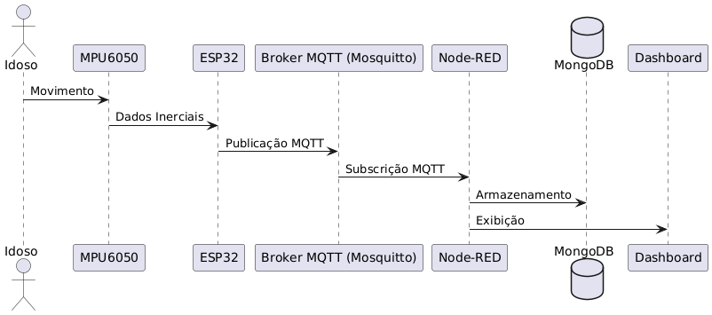

# esp32-fall-guard
A real-time fall detection system using ESP32, MPU6050, and MQTT. Collects accelerometer and gyroscope data, publishes to an MQTT broker, and supports historical analysis and visualization. Extensible for machine learning-based fall prediction, with Docker support for easy deployment and scalability.

# Docker

To start docker, run this command in the root directory:

```
docker-compose up
```

# Arquitetura do Sistema

